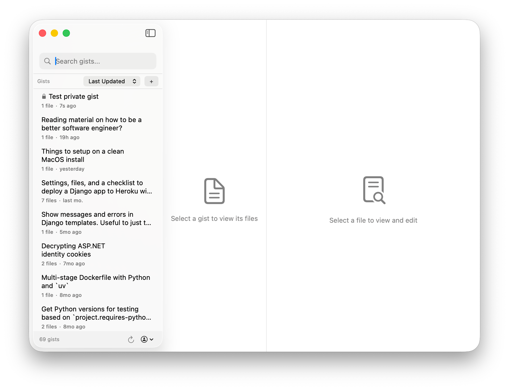
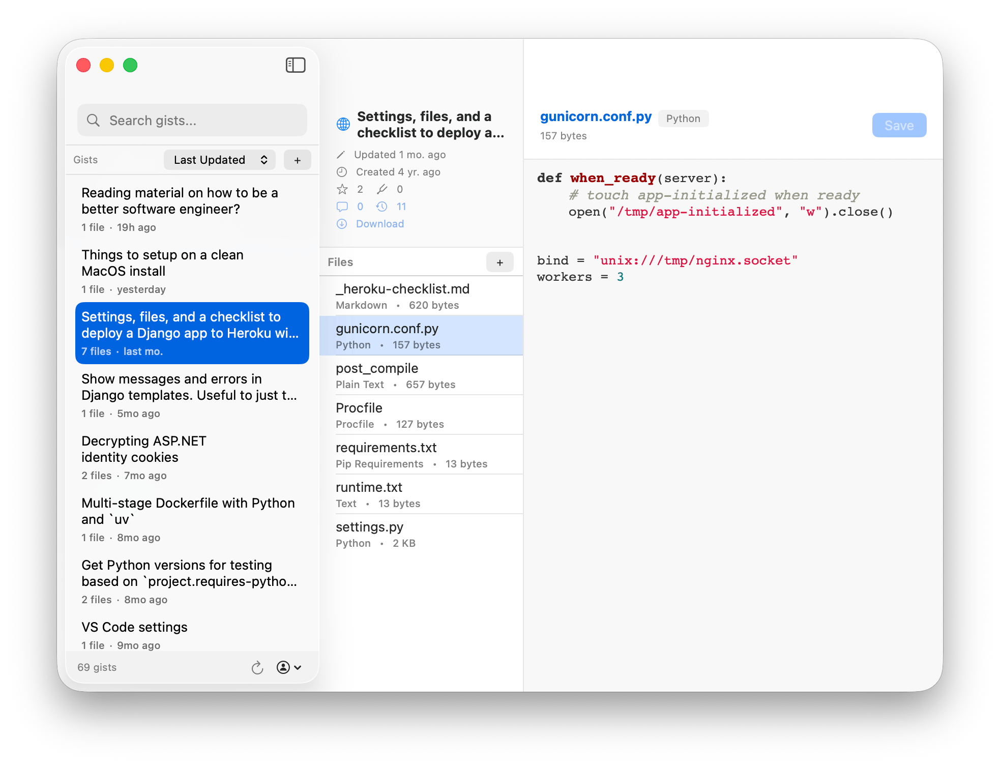
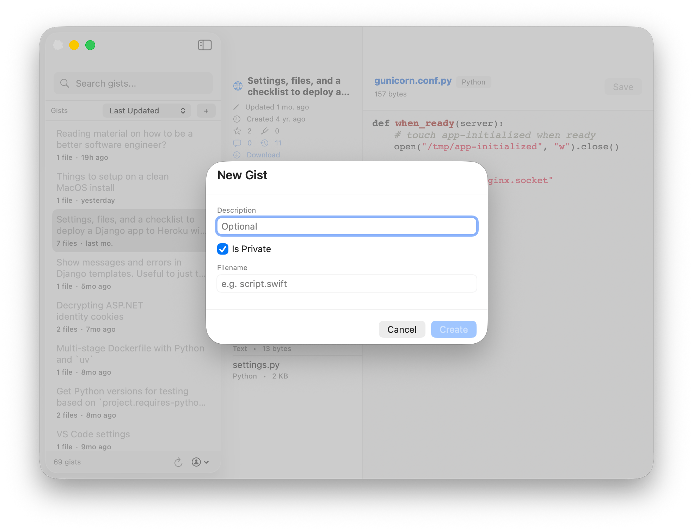
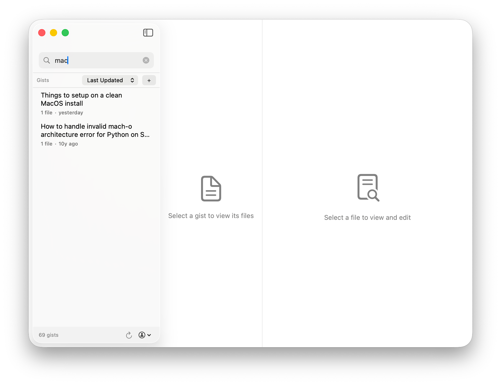

# Jisticle 📄

> The native macOS client for Gists because GitHub seems to have forgotten that they exist.

Jisticle is a native macOS Gist client built with SwiftUI. It's fast, it's clean, and the UI was updated within the last decade. Hopefully it helps managing your Gists feel natural and delightful.

## ✨ Features

* 🔍 **Lightning-Fast Search** - Find any gist instantly with the fuzzy finder in the sidebar
* 🎨 **Syntax Highlighting** - Full-featured code editor with language detection and beautiful highlighting
* ✏️ **Edit Gists Seamlessly** - Modify files and save changes directly without leaving the app
* ➕ **Create New Gists** - Quick creation with public/secret toggle and instant publishing
* 🗑️ **Delete with Confidence** - Remove unwanted gists as needed
* 📱 **Modern Three-Pane Layout** - Native macOS design that feels right at home
* 💾 **Smart Caching** - Gists are cached locally for instant access even when you're offline
* 🔐 **Secure GitHub Authentication** - Uses GitHub's Device Flow OAuth, no client secrets required
* 🔒 **Keychain Security** - Your GitHub token is stored securely in macOS Keychain

<!-- Screenshots will go here -->
<table>
  <tr>
    <td></td>
    <td></td>
  </tr>
  <tr>
    <td></td>
    <td></td>
  </tr>
</table>

## 🛠️ Getting Started

1. Download the latest `.dmg` from the [Releases](https://github.com/adamghill/jisticle/releases) page.
2. Drag `Jisticle.app` to your Applications folder.
3. Launch the app and sign in with your GitHub account.

> [!IMPORTANT]
> **"Apple could not verify..."?**
> Since Jisticle isn't signed with an Apple Developer certificate (yet!), macOS will block it by default.
>
> **To open it:**
> 1. Try to open `Jisticle.app` (it will fail with the warning).
> 2. Open **System Settings** -> **Privacy & Security**.
> 3. Scroll down to the **Security** section and click **Open Anyway**.
> 4. Authenticate and click **Open** one last time.
>
> *Alternatively, run this in Terminal:*
> ```bash
> xattr -cr /Applications/Jisticle.app
> ```

## 📋 Requirements

- macOS 14.0+
- GitHub account

## 🏗️ Build from Source

```bash
# Clone the repository
git clone https://github.com/adamghill/jisticle.git
cd jisticle

# Install dependencies and build
swift package resolve
swift build

# Or use `just` (requires `just` to be installed)
just run
```

## 📦 Release Build

```bash
just build-release [version]
```

This creates `Jisticle-macOS.dmg` ready for distribution.

## 🤝 Contributing

Have an idea for Jisticle? Open a PR! ❤️

## 📜 License

MIT
